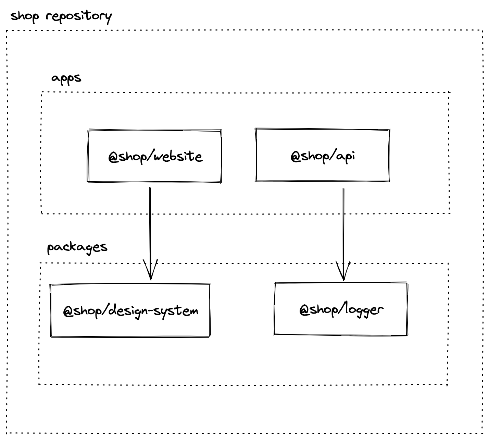

# Surviving Monorepos

- [Surviving Monorepos](#surviving-monorepos)
  - [What is a Monorepo?](#what-is-a-monorepo)
  - [Monorepos with Node.js](#monorepos-with-nodejs)
  - [Example](#example)
  - [Tools \& Frameworks](#tools--frameworks)
  - [Install PNPM](#install-pnpm)
  - [PNPM Workspace](#pnpm-workspace)
    - [Why using pnpm and not npm or yarn?](#why-using-pnpm-and-not-npm-or-yarn)
    - [What is a pnpm workspace?](#what-is-a-pnpm-workspace)
  - [Package Structure](#package-structure)
  - [Configs](#configs)
  - [eslint](#eslint)
  - [tsconfig](#tsconfig)
  - [vite](#vite)
  - [Turborepo](#turborepo)
    - [What is Turborepo?](#what-is-turborepo)
    - [Turborepo Cache](#turborepo-cache)
    - [Turborepo Remote Cache](#turborepo-remote-cache)
  - [Dockerfile](#dockerfile)
  - [Docker build](#docker-build)
  - [Deploy](#deploy)
  - [CI Pipeline with Github actions](#ci-pipeline-with-github-actions)
  - [FAQ](#faq)
    - [Why Turborepo and not nx?](#why-turborepo-and-not-nx)
  - [Why not use typescript project references?](#why-not-use-typescript-project-references)

## What is a Monorepo?

> A monorepo is a single repository containing **multiple distinct projects**, with **well-defined relationships**.

[https://monorepo.tools/#what-is-a-monorepo](https://monorepo.tools/#what-is-a-monorepo)

Pros:

- Ease of code reuse
- Simplified dependency management
- Atomic commits
- Large-scale code refactoring
- Collaboration across teams

Cons:

- Monorepos are expensive - it should be treated as a product that requires additional people and and special tools.
- More complex to setup and maintain - requires a team with specialized skills
- Version control scalability issues - simple git operations become slow
- Build system scalability issues - you can’t just run build or test command for your whole codebase.
- CI complexity - build and deployment pipelines become very complex
- Major dependency updates become hell - you need to do updates across a large codebase that no single person understands as a whole

Putting all your company code or code from different products in one repo **is not a good idea** if unless you are Google, Meta, Microsoft…

It is much more practical and efficient to separate repositories per product area and enable teams to colocate related code and be autonomous.

You are probably going to end up with **multiple monorepos** in one company split per domain! 😉

## Monorepos with Node.js

Historically Node.js had very poor support for structuring complex applications in one repository:

- Until npm 7 there was no standard way in Node.js to define multiple packages in one repository. npm introduced support for workspaces on 13th of October 20.
- Node.js doesn’t have internal build tool that understands dependencies between packages in one repo. Custom tools like lerna, nx, turborepo need to be used to run a task like build in correct order respecting all dependencies.

## Example

Lets build a dummy e-com website that has a frontend application and an api. We also need to have library of our design system components and we have some shared utilities like logger.



The purpose of the demo is to show how to implement common tasks in a Monorepo:

- [x] Sharing configuration files for different tools
- [x] Running everything in development mode
- [x] Running lint
- [x] Running tests
- [x] Building docker images
- [x] Pipeline
  - [x] `build`, `test`, `lint` for only affected packages
  - [x] `publish docker images` for only affected apps

## Tools & Frameworks

- [pnpm](https://pnpm.io/) as package manager
- [pnpm workspace](https://pnpm.io/workspaces) to structure everything in one repo.
- [NextJS](https://nextjs.org/) for frontend application.
- [tsx](https://www.npmjs.com/package/tsx) for running `api` server in development mode. We also use it to transpile typescript on the fly and to run them, like deploy script below for example.
- [vite](https://vite.dev/) for bundling `packages`.
- [eslint](https://eslint.org/) for code style rules.
- [prettier](https://prettier.io/) for code formatting rules.
- [vitest](https://vitest.dev/) for unit testing.
- [Turborepo](https://turbo.build/repo) for orchestrating tasks between packages.

## Install PNPM

To install pnpm, follow the instructions on the [pnpm website](https://pnpm.io/installation).

## PNPM Workspace

### Why using pnpm and not npm or yarn?

- pnpm uses symlinks when installing dependencies https://pnpm.io/symlinked-node-modules-structure. This has multiple benefits:
  - Storage of node_modules is much more efficient
  - It handles multiple versions of the same package in one repo much better
  - It requires every package to declare correctly all its dependencies - nothing relies on root node_modules.
- pnpm is faster than npm and yarn: https://pnpm.io/benchmarks
- pnpm supports advanced features https://pnpm.io/feature-comparison

### What is a pnpm workspace?

> Workspaces is a generic term that refers to the set of features in the npm cli that provides support to **managing multiple packages** from your local file system from within a singular top-level, **root package**.

Workspace consists of many npm packages. To create workspace with npm you need to follow these steps:

```bash
# create new empty directory for your monorepo
$ mkdir shop
$ cd shop
# init new npm package with default options
$ pnpm init -y
```

You will get `package.json` file which will be root for your workspace.

Root `package.json` needs to have `workspaces` property define and needs to be marked was `private`:

```json
{
  "name": "shop",
  "private": true,
  "version": "1.0.0",
  "description": ""
}
```

Create `pnpm-workspace.yaml` file in the root of your workspace:

```yaml
packages:
  - apps/*
  - packages/*
  - configs/*
```

In workspaces we defined that we are going to put all our packages in three groups:

- `configs` will hold all packages with sharable configuration files for tools that we use. In our example we have:
  - `eslint-config-custom (eslint-config-custom)` sharable eslint configuration.
  - `tsconfig (@shop/tsconfig)` sharable typescript configuration.
  - `vite (@shop/vite)` sharable vite configuration.
- `apps` will hold all executable packages from our system. These can be `apis`, `websites`, `cli tools`, anything that is executed directly and not referenced like a package by anything else in the system. In our example we have:
  - `api (@shop/api)` example api implementation using express.
  - `website (@shop/website)` example website implementation using nextjs.
- `packages` will hold all packages that we want extract as logical or sharable parts of our codebase. These packages can be UI components or backend services that can be used by one or many `apps` or other `packages`. In our example we have:
  - `logger (@shop/logger)` simple logger package that is used in both `api` and `website`.
  - `design-system (@shop/design-system)` dummy package acting as a design system package.
  - `core (@shop/core)` dummy core package that is used by the `logger` just to demonstrate how nested dependencies work.

Inside the workspace packages can reference each other like any other package on npm. For example in `@shop/api` in folder `apps/api` we want to use logger from `@shop/logger`, so we add it to `apps/api/package.json`:

```json
{
  //...
  "dependencies": {
    "@shop/logger": "workspace:*"
    //...
  }
}
```

Asterisk above means that we don't really care about the version of the package.

Once you setup your workspace you can execute all tasks for the whole repo from the root. For example lets say you want to run tests just for `@shop/api`:

```bash
$ pnpm -F @shop/api run test
```

you can also add additional params to the command, for example to run test in watch mode:

```bash
$ pnpm -F @shop/api run test --watch
```

## Package Structure

When we define a `package` or an `app` we want to define a set of commands that allow us to do usual development tasks, these commands are:

- `lint` to check the code style of all files in a package. We use `eslint` for this.
- `test` to run tests for a package. We use `vitest` for this.
- `build` to transpile typescript into javascript and to produce css from `scss` or any other way of defining styles. For packages we use `vite` for this, for `api` we simply use `tsc` and for `website` we use `next build`.
- `dev` to watch for changes in any dependant source file and to rebuild the package or restart the application when change occurs. This means for example, when we run `dev` and we change `logger` we want `logger` to be built and `api` and `website` to be restarted and new `logger` changes to be applied as those apps both depend on the `@shop/logger`. To support this in packages we use `vite`, for `api` use `tsx` and for `website` we use `next dev` command. You can you any tool or framework as long as you configure it to restart or rebuild when any dependant file changes.
- `deploy` is used in `api` and `website` to build docker image and push it to docker registry.

We will use typescript for all our code. And all our code will be transpiled only to ESM, this means that in each `package.json` you will see `"type": "module"`.

Also to make importing of a package easy, we define in each package exports like:

In `packages/logger`:

```json
//...
"exports": {
    ".": "./dist/index.js",
    "./*": "./dist/*"
}
//...
```

This means that user of the package can import it like:

```js
import * as logger from "@shop/logger"; // imports packages/logger/dist/index.js
```

or to import styles for example:

```js
import "@shop/design-system/style.css"; // imports packages/design-system/dist/style.css
```

## Configs

Since we are going to potentially have many `packages` and `apps` in our repo, we need to make sure that we manage configuration of above tools efficiently. This means defining configuration once for each tool and for each use case and reuse this across the whole repo. In our case in `configs` folder we have following sharable configurations defined:

## eslint

Sharable configuration is defined in `configs/eslint-config-custom`. We use the global configuration in each of our packages like:

In `packages/logger/.eslintrc`:

```json
{
  "root": true,
  "extends": ["custom"] // eslint knows to look for package called "eslint-config-custom"
}
```

In eslint configuration we added also `prettier` configuration, so when we run eslint it will also check code formatting rules implemented by prettier.

## tsconfig

Sharable configuration is defined in `configs/tsconfig`. We have multiple configurations:

- `base.json` contains all common properties for all packages.
- `next.json` contains NextJS specific configuration.
- `react-library.json` contains configuration specific to react based packages.

We use sharable configurations like:

In `packages/logger/tsconfig.json`:

```json
{
  "compilerOptions": {
    "outDir": "./dist",
    "rootDir": "./src"
  },
  "exclude": ["node_modules"],
  "extends": "@shop/tsconfig/base.json", // extends from base configuration
  "include": ["src"]
}
```

## vite

`vite` is used as a bundler for all packages. Sharable configuration is defined in `configs/vite`. Configuration is defined to do following tasks:

- builds everything only as ES modules.
- builds files only inside of the package, it treats all other as externals.
- dev mode watches for all referenced files in the repo and rebuilds the package when any change occurs. This means when `@shop/core` is changed `vite` will rebuild it and since `@shop/logger` is watching for changes in `core/dist` it will also be rebuilt.
- build bundles everything to `dist/index.js` and if there are styles, they will be in `dist/style.css`.
- build outputs `sourcemaps`, so that you can easily debug from typescript source files.
- build does type checking and generates typescript definition files `.d.ts`.
- test contains configuration for vitest globals, so that you don't have to explicitly import `describe`, `it` in every `spec` file.

You can use any other build tool like `tsup`, `webpack` or `rollup` instead of `vite`, as long as above requirements are met.

## Turborepo

### What is Turborepo?

> Turborepo is a high-performance build system for **JavaScript and TypeScript codebases**.

[https://turbo.build/repo](https://turbo.build/repo)

Features:

- Understands your workspace and can execute task in correct order 👍
- Can cache results of task executions - it doesn’t execute same task twice if no code has been changed 🥰
- Understands git and can execute a task for only affected part of the codebase 😲
- Supports remote task results caching - task gets executed once and everyone can reuse results locally 🤯

To explain why we need turbo repo lets take an example. Lets say that we want to build `@shop/api`. Looking at dependencies in `package.json` we see that it depends on `@shop/logger`, so it needs to be built first, but if it has any dependencies those would have to be built first and so on... You never want to maintain this build configuration manually, turborepo solves this problem for you.

Here is how we add turbo to our repo:

From repo root run:

```bash
$ npm install -D turbo
```

Add turbo.json with following content:

```json
{
  "$schema": "https://turborepo.org/schema.json",
  "pipeline": {
    "build": {
      "dependsOn": ["^build"],
      "outputs": ["dist/**", "next/**"]
    },
    "lint": {
      "outputs": []
    },
    "test": {
      "outputs": []
    },
    "dev": {
      "cache": false,
      "dependsOn": ["^build"]
    },
    "deploy": {
      "cache": false,
      "dependsOn": ["^build"]
    }
  }
}
```

The file above tells turborepo that we want it to handle `build`, `lint`, `test` and `dev`. It also tells turbo repo that commands `build`, `lint`, `test` can be cached, this means that once a command is executed, turborepo will store `stdout` and any files that you specify in `outputs` and if you execute the command again without changing any files in the package, it will just pull cached results without executing underlying command again. For `dev` command we don't want to cache any output and we define that build is required before dev.

In our root `package.json` we define following commands using turborepo in `scripts` section:

```json
{
  "test": "turbo run test",
  "test:affected": "turbo run test --filter=${BASE_COMMIT:-...[origin/main]}",
  "lint": "turbo run lint",
  "lint:affected": "turbo run lint --filter=${BASE_COMMIT:-...[origin/main]}",
  "lint:fix": "turbo run lint -- --fix",
  "build": "turbo run build",
  "build:affected": "turbo run build --filter=${BASE_COMMIT:-...[origin/main]}",
  "dev": "turbo run dev --parallel",
  "dev:api": "turbo run dev --filter=@shop/api... --parallel",
  "dev:website": "turbo run dev --filter=@shop/website... --parallel",
  "deploy": "turbo run deploy",
  "deploy:affected": "turbo run deploy --filter=${BASE_COMMIT:-...[origin/main]}"
}
```

As you can see from the above, turborepo has another great feature - running command for only affected part of our codebase! This means, if we change a file in `@shop/design-system`, when we run test command in our CI, **we want** to run tests only for `@shop/design-system` and `@shop/website` since it depends on design-system, but **we don't want** to run tests for `@shop/logger` and `@shop/api` since they are in no way affected by the changes we made. This can dramatically improve performance of our pipeline.

Now everything is setup and we can start using turborepo.

Lets do a simple test. Make a change in `packages/logger/index.ts` and add a dummy comment:

```ts
import pino from "pino";

const logLevel = process.env.LOG_LEVEL ?? "info";

export const logger = pino({
  level: logLevel,
});

// dummy test
```

Run `build:affected` command from the root of the repo:

```bash
$ pnpm run build:affected
```

In the output you should see that build was executed only for `@shop/logger` and `@shop/api` packages since no other package is affected by the change 😍

If your repo has multiple applications like `api` and `website` you can also use turborepo to start development only for subset of packages that are related to one application. In our package.json we have `dev:api` and `dev:website` commands that can start development mode for packages need for api or website only.

### Turborepo Cache

Turborepo caches command execution results, what this means is that if you run the same command without changing any source file, turborepo will just pull the result from cache.

Lets test this. Run the build command from repo root:

```bash
$ pnpm run build
```

After the first run you should see build for all packages executed and results are shown in the output:

```
 Tasks:    4 successful, 4 total
Cached:    0 cached, 4 total
  Time:    10.567s
```

If you run the same command again, everything should be already cached and results are shown immediately:

```
 Tasks:    4 successful, 4 total
Cached:    4 cached, 4 total
  Time:    141ms >>> FULL TURBO
```

This is simply amazing 🥳

By default turborepo stores it's cache at `node_modules/.cache/turbo`.

If you want to execute commands with turbo, but bypass cache completely, just add `--force` flag.

```bash
$ pnpm run build --force
```

### Turborepo Remote Cache

Turborepo has a killer feature to use **remote cache**. What that means is that turborepo can store results of execution on a remote server and then any other developer running turborepo for the first time on their local machine will get results from the remote server without really executing the underlying command 🤯 This also means that when you checkout `main` branch and run any command, you would get instant results since the remote server's CI already ran all the steps for you ❤️.

Vercel, company that sponsors turborepo development, offers free remote cache storage. To set it up, follow instructions here https://turbo.build/repo/docs/core-concepts/remote-caching#vercel.

There are many open source implementations of turborepo remote cache, so you can self-host remote cache server. One that I used: https://github.com/Tapico/tapico-turborepo-remote-cache.

## Dockerfile

We create `Dockerfile` for each deployable application, in our example we have `api` and `website` apps. We want our docker images to contain only necessary files run one specific app - we don't want to put whole node_modules in every docker image as this is going to increase image sizes significantly.

Before building a docker image with only necessary files we need to:

- Build only packages which our application depends on.
- Somehow "select" part of our workspace which an application depends on and install dependencies only for those packages.

Of course, Turborepo can do exactly these tasks.

For example, to build only `api`, with turborepo it is enough to run from root of the repo:

```bash
$ npx turbo build --filter=@shop/api
```

This will make sure all required dependencies are built.

## Docker build

Since we have many applications in one repo, we need to be able to build docker images for each of them. To do this we use [turbo prune](https://turbo.build/repo/docs/reference/command-line-reference/prune) feature. This feature allows us to copy only necessary files from our repo to a new directory and then we can use that directory to build docker image.

For example, to prepare files for `@shop/api`, go to the root of the repo and run:

```bash
$ npx turbo prune --filter=@shop/api
```

This command will copy all the necessary dependencies from our repo needed to run `@shop/api` to `out` directory in the root of the repo. And we will use that `out` directory in our Dockerfile to build the image. In the `out` folder you will find `json` and `full` folders, explanations for those you can find in the official docs [here](https://turbo.build/repo/docs/reference/command-line-reference/prune).

Dockerfile for `@shop/api` is very simple:

```Dockerfile
FROM node:18.12.1-buster-slim AS builder

ENV PNPM_HOME="/pnpm"
ENV PATH="$PNPM_HOME:$PATH"
RUN corepack enable

ENV UV_THREADPOOL_SIZE 64
ENV NODE_ENV=production

WORKDIR /app

COPY ./json .
RUN pnpm install --prod --frozen-lockfile

COPY ./full .

USER node

EXPOSE 3000

ENV PORT=3000

WORKDIR apps/api

CMD ["pnpm", "start"]
```

> 💡NOTE: Important to remember is that we need to build the app before building the docker image.

Dockerfile for `@shop/website` looks almost the same.

## Deploy

Each application defines it's own deploy script in `scripts/deploy.ts`. In our example, this script is responsible for building docker image and pushing it to docker registry. I've intentionally duplicated the code between `@shop/api` and `@shop/website` as deploy steps may differ for each application, you should of course organize/reuse the code for deployment however you see fit.

Script is written using [google/zx](https://github.com/google/zx) which makes it very easy to write scripts in TypeScript.

We defined deploy command in `package.json`:

```json
{
  "scripts": {
    "deploy": "tsx scripts/deploy.ts"
  }
}
```

and we can run it using pnpm:

```bash
$ pnpm -F @shop/api run deploy
```

You need to use `run` above as `deploy` also exists as a command in `pnpm` and it will try to run it instead of running our script.

## CI Pipeline with Github actions

Github actions pipeline is implemented in `.github/workflows/simple.yml`. Pipeline implements following steps:

- code checkout
- pnpm install
- build:affected
- lint:affected
- test:affected
- deploy:affected

Following optimizations are implemented in the pipeline:

- `node_modules` are cached and reused in all jobs. This makes `pnpm install` really fast.
- Turborepo remote cache is setup, so build agents can use and create entries in remote cache. This makes the whole pipeline very fast as most of the time command results are retrieved from the cache.
- Using turborepo we are running tasks only for affected packages. This is done using `nrwl/nx-set-shas@v3` github action. Action finds the latest commit that had successful build and uses it to determine what packages are affected in the meantime.
- Docker build is running in `deploy` step only if application is affected.
- Docker builds are done in parallel.
- When building docker images `--cache-from` flag is used to reuse build results from previous run.

Full pipeline execution time is ~2min, without docker build it is ~1min. If only `README.md` is change, build takes around ~30s.

## FAQ

### Why Turborepo and not nx?

Currently nx is much more powerful tool than turborepo, here is my list of pros and cons.

Pros

- nx is around for many years and is developed by an amazing team.
- It supports all features from Turborepo and much more.
- It can be used for any language, not just Node.js.
- Has very advanced build features like distributed task execution!
- Has support for code templates.
- Has very nice dashboards that show how much time it saved you:


Cons

- Much more complex to setup and understand. It is a very generic and powerful tool and because of that it is simply harder to get started with.
- It wraps common tools in custom plugins with custom configuration forcing you to do setup your repo in a very different way. With Turborepo you setup everything as you usually would do and you just add it at the end in 5mins.
- Remote cache option is a paid feature (NX does have generous free tier 👏), with Turborepo it is free and you can easily self-host it.

In general I would use nx if I had a really big repo, but on the other hand I don’t want to have a really big repo ever again 😉

## Why not use typescript project references?

[Typescript project references](https://www.typescriptlang.org/docs/handbook/project-references.html) are a great feature, but I for me they have couple of downsides:

- I didn't find a simple way to use them without duplicating dependency configuration that already exists in `package.json` files.
- Build tools need to be explicitly configured to use typescript project references with [tsconfig-paths](https://www.npmjs.com/package/tsconfig-paths) or [tsc-alias](https://www.npmjs.com/package/tsc-alias) which adds more complexity.
- Development mode and production build are very different which complicates the whole configuration.
- You end up transpiling on the fly over and over again the same set of files for both the dev mode and for running tests which eventually slows down your development experience.
- You loose ability to cache build results between runs.
- If you need to start publishing some packages to npm, configuration becomes unmaintainable.

Instead, my approach is to follow these rules:

- Use only `package.json` to define dependencies between packages and use only `pnpm` and `turbo` to orchestrate tasks between packages.
- Every package is configured as if it is going to be published to npm. This means it has to be built first before it can be used by the other apps and packages in the workspace. It should be built only when needed and only once. Build output should be cached by `turbo`. At the same time the consumer of the package should not care if the a local workspace package or a package downloaded from npm, it uses both in the same way.
- An app or a package needs to have a way to watch for changes in all of it's dependencies and to rebuild/restart it's self when change occurs. This can be done using `vite build --watch`, `next dev` or `tsx watch` for example.
